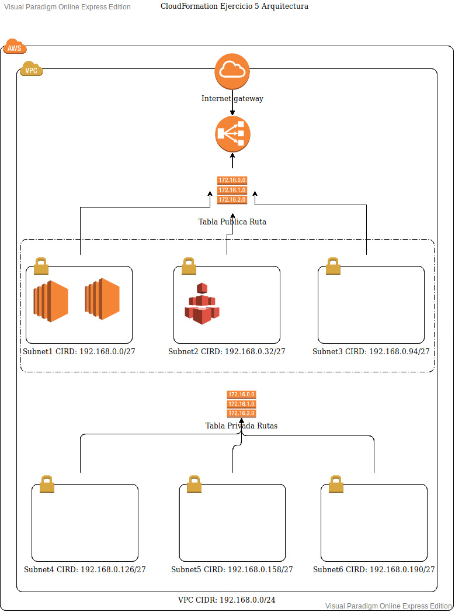

# Trambo Cloud | Cloud Formation
## Exercise 5

Create exercise 4 using cloudformation
- Consider:
 - Use nested stacks to add logic to each resource
 - Create the vpc from excercise 3 without peering

 # main.yml

 ### Parameters
<!---->
| Parameter      | Description | Type    |
| :---        |    :----:   |          ---: |
| Template     | S3 Bucket  in which the templates are stored     |   String |
| VPC     | Name of the vpc that will be created   |   String |
<!---->

### Rescursos

#### Network Stack
* This stack is in charge of creating the resources in the vpc.yml file. This file will create everything related to private and public networks
* Stack Definition: vpc.yml
##### Parametros De Stack
<!---->
| Parameter      | Description | Type    |
| :---        |    :----:   |          ---: |
| VPCName     | Name of the vpc     |   String |
<!---->

#### EFSStack
* This stack is in charge of creating the EFS Volume
* Stack Definition: efs.yml

##### Parametros De Stack
<!---->
| Parameter      | Description | Type    |
| :---        |    :----:   |          ---: |
| VPCId    | ID of the created VPC   |   String |
| PublicSubnet1    | ID of the public subnet 1 created in the NetworkStack   |   String |
| PublicSubnet2    | ID of the public subnet 2 created in the NetworkStack    |   String |
| PublicSubnet3    | ID of the public subnet 3 created in the NetworkStack    |   String |
| SecurityGroupVPC    | ID of the security Group created in the NetworkStack |   String |
<!---->

#### LCAutoScaling
* This stack is in charge of creating the launch configuration that each EC2 instance will have.
* Stack Definition: lconf.yml

##### Parametros De Stack
| Parameter      | Description | Type    |
| :---        |    :----:   |          ---: |
| SecurityGroupLC    | ID of the security group   |   String |
| EFSVol    | ID of the EFS volume created in the EFSStack  |   String |

#### AutoScalingStack
* Stack in charge of creating the Auto Scaling Group
* Stack Definition: scl.yml

##### Parametros De Stack
| Parameter      | Description | Type    |
| :---        |    :----:   |          ---: |
| LaunchConfiguration    | Launch Configuration id created in the LCAutoScalingStack   |   String |
| EFSVol    | ID of the EFS Volume create in the EFSStack  |   String |
| Subnet1    | ID of the public subnet 1   |   String |
| Subnet2    | ID of the public subnet 2     |   String |
| Subnet3    | ID of the public subnet 3    |   String|
| SGroup    | ID of the Security Group created  |   String |

## Diagrama
